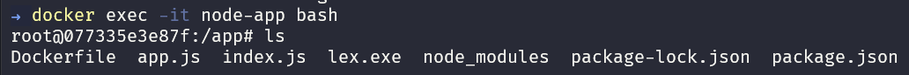
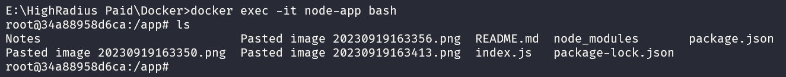

# Dockerizing an Express App 
We are going to dockerize an `express` application.
## Express App
>This code sets up a basic Express server that listens for incoming GET requests on the root path ("/") and responds with a simple "Hi There" message in HTML. The server will listen on either the port specified in the `process.env.PORT` environment variable or port `3000` if the environment variable is not set.

```javascript {.line-numbers}
const express = require("express")
const app = express();
app.get("/", (req, res) => {
    res.send("<h2> Hi There </h2>");
});
const port = process.env.PORT || 3000;
app.listen(port, () => console.log(`listening on port ${port}`))
```

## Docker Image
>In Docker, everything is based on Images. An image is a combination of a file system and parameters. Let’s take an example of the following command in Docker.
### Creating a Docker image
- Docker images are built using `Dockerfile`   
- Docker images are built using layers 
- Check the below example:
```Dockerfile {.line-numbers}
FROM node:15
WORKDIR /app
COPY package.json .
RUN npm install
COPY . ./
EXPOSE 3000
CMD ["node", "index.js"]
```

- The above `Dockerfile` will create an image from a base image `node:15` `[IMAGE_NAME:TAG]`. Here we are using a base image of `node` version `15`. 
- Docker Images are build layer wise. 
- Here `FROM node:15` is base layer, and above that layer all other layers are cached.
#### Let's look deeper into the code
- `WORKDIR /app` will set the working directory inside the container.
- `COPY package.json .` will copy the `package.json` file which is present locally inside the container to install dependencies. 
- `RUN` it is an image build step the state of the container after a `RUN` command will be committed to the container image. A Dockerfile can have many `RUN` steps that layer on top of one another to build the image.
- `RUN npm install` it will install all the dependencies which is listed in `package.json`.
- `EXPOSE 3000` this will expose the port 3000.
- `CMD` is the command the container executes by default **when you launch** the built image. A Dockerfile will only use the final `CMD` defined. The `CMD` **can be overridden** when starting a container with `docker run $image`
- `CMD ["node", "index.js"]` this will execute the command inside the container in order to run the `express` app.
So, basically the above code are the instructions or steps which should be executed sequentially while building an container from an image.

#### Docker Build
>To build an image from this `Dockerfile` you need to execute this command `docker build` command.
`docker build` command builds Docker images from a `Dockerfile`.

General Docker Build Image Command
`docker build [OPTIONS] PATH | URL | -`

Building our Docker Image:
`docker build -t node-app-image .`  
## Docker Container
>Containers  are instance of docker images that can be run using `docker run` command Basic purpose of Docker is to run containers.
### Running a Container
- Running containers is managed by `docker run` command. To run a container we use following command.
- We will be running our `express-app` using docker image which we created earlier `node-app-image`.
#### Docker run `fas:ProjectDiagram`
>The `docker run` command runs a command in a new container, pulling the image if needed and starting the container.
  You can restart a stopped container with all its previous changes intact using `docker start`Use `docker ps -a` to view a list of all containers, including those that are stopped.

##### To run our docker container `node-app-image` we will execute:
```sh
docker run -p 4000:3000 -d --name node-app node-app-image
```
###### Command Breakdown `fas:Terminal`
- `docker run` Runs the command in container, pulling image if needed.
- `docker run -p 4000:3000` So, as docker container are completely isolated from other systems, so we can't access our `express-app` from outside container, instead we can specify that the traffic coming to the port `4000` in our local machine should be redirected to port `3000` of the docker container.
- `docker run -p 4000:3000 -d` this flag `-d` detaches our container from our terminal and runs the container in background, though printing the container id to terminal.
- `docker run -p 4000:3000 -d --name node-app node-app-image` specifying the container name `node-app` and giving the image `node-app-image` to run a container.
### Running an interactive shell inside container

- If you need to start an interactive shell inside a Docker Container, perhaps to explore the file system or debug running processes, use `docker exec` command with `-i` and `-t` flags.
- The `-i` flag keeps input open to the container, and the `-t` flag creates a pseudo-terminal that the shell can attach to. These flags can be combined like this:
```sh
$ docker exec -it node-app bash
```

- In the above screenshot we can see all the files inside our container.
- We can see that there are some unnecessary files like `Dockerfile`, `node_module` which aren't necessary.
- These files are creating inside docker container because of `COPY . ./` command in our `Dockerfile`.
- So, to don't include these files or folders inside our container we will use `.dockerignore`.
### Docker Ignore
- Create a file inside your project folder `.dockerignore`.
- Include all the file and folder names in the file which you don't want to copy inside the container.
```dockerignore
node_modules
.vscode
Dockerfile
.gitignore
files
.obsidian
```
- Re build the docker image
```sh
$ docker built -t node-app-image .
```


In the above screenshot, we can see that now after re building the image, with the help of `.dockerignore` there no unnecessary files in our container.
## Docker Volumes 
### Bind Mount
- When we edit or update our file in our local machine, the file didn't gets updated inside docker container.
- To update that file inside our container, we need to build the image again using `docker build` command.
- To overcome this issue, we use `volumes` in docker, to synchronize our files between local and container.
```sh
$ docker run -v pathToFolderOnLocal:pathToFolderOnContainer -p 4000:3000 -d node-app node-app-image
```
- `pathToFolderLocal`: need to pass the absolute path i.e `E:\HighRadius Paid\Docker\Dockerfile`
- `pathToFolderOnContainer`: `/app`
#### Current Working Directory Variables [Optional]
1. Windows Command Shell: `%cd%`
2. Windows PowerShell: `${pwd}`
3. Mac or Linux Shell: `$(pwd)`

```sh
docker run -v %cd%:/app -p 4000:3000 -d --name node-app node-app-image 
```
### Anonymous Mount
>Suppose we delete our `node_module` folder from our local machine, and run our container, Inside the container `node_modules` folder will be created due to `npm install` command.
>But due to `bind mount` as the volumes are synced, it will delte the `node_modules` folder inside the container also.

To avoid this problem we will use `Anonymous mount`.
```sh
$ docker run -v ${pwd}:/app -v /app/node_modules -p 4000:3000 -d --name node-app node-app-image
```

`-v /app/node_modules` It will preserve this folder from bind mount. It overrides the bind mount.
#### Changing the `Docker` file system to read only
To change the docker file system to read only we use 
```sh
:ro (to be used with volumes -v)
```

```sh
$ docker run -v ${pwd}:/app:ro -v /app/node_modules -p 4000:3000 -d --name node-app node-app-image
```
#### Deleting Volumes in docker

- Displaying the volumes
```sh
$ docker volume ls
```

- Deleting a volume
```sh
$ docker volume <Volume Name>
```

- Deleting a volume while deleting a container
```sh
$ docker rm node-app -fv
```

- Deleting all volumes
```sh
$ docker volume prune
```

## Docker Compose
### Overview
>When using Docker extensively, the management of several different containers quickly becomes cumbersome.
>Docker Compose is a tool that helps us overcome this problem and **easily handle multiple containers at once.**

### YAML Configuration
Docker Compose works by applying many rules declared within **a single 
`docker-compose.yml` configuration file**.
These [YAML](https://en.wikipedia.org/wiki/YAML) rules, both human-readable and machine-optimized, provide an effective way to snapshot the whole project from ten-thousand feet in a few lines.
Almost every rule replaces a specific Docker command, so that in the end, we just need to run:
```sh
$ docker-compose up -d
```

A Basic `docker-compose.yml` file looks like this:
```yaml
version: "3"
services:
  node-app:
    build: .
    ports:
      - "4000:3000"
    volumes:
      - ./:/app
      - /app/node_modules
    environment:
      - PORT=3000
    # env_file:
    #   - ./.env
```

Shutting down a container
```sh
docker-compose down -v
```
> `-v` flag to delete mounted volumes also.
